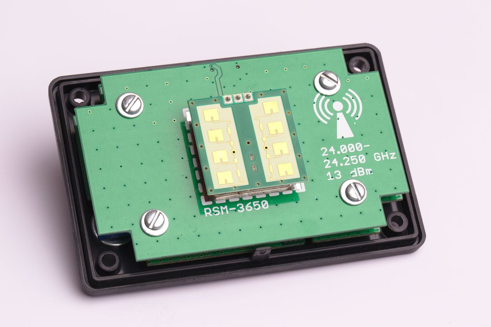
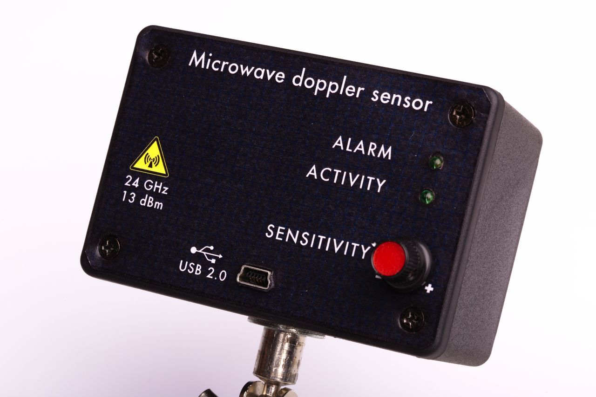
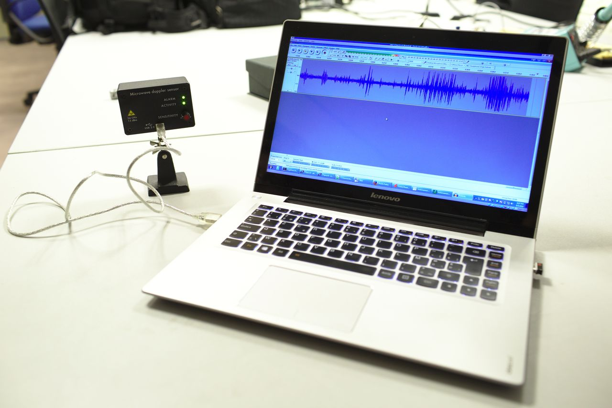
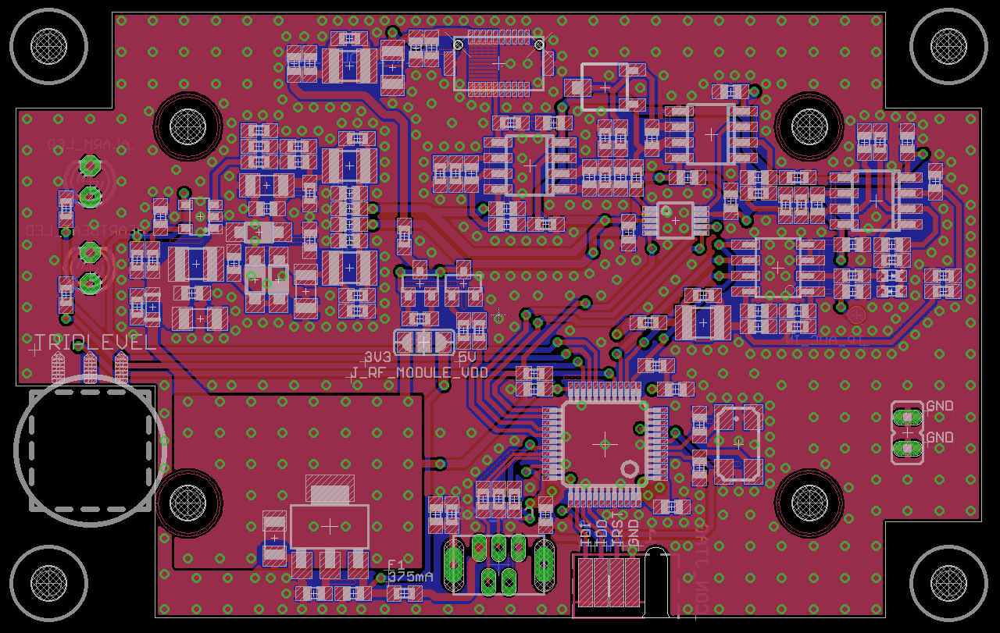
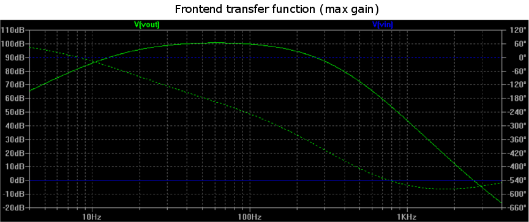
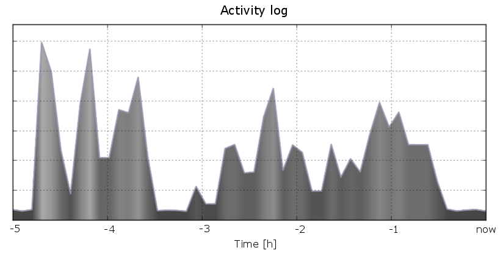
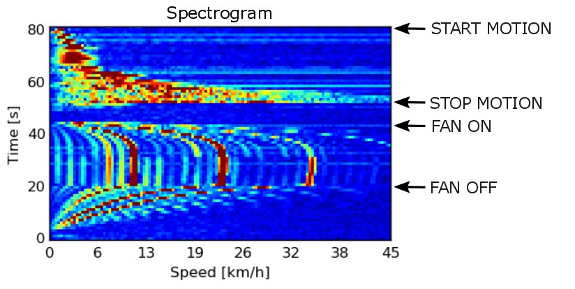

motionsensor
============

Microwave doppler effect motion sensor

Features
--------

- USB-powered (150 mA)
- Wakes up host computer on alarm (USB remote wakeup)
- Standalone operation (no PC or USB host required)
- Live velocity (IF) monitoring via USB audio stream to PC
- Automatic gain control
- Data logging
- Driverless operation: tested on Windows XP, Windows 7, Ubuntu GNU/Linux 14.04

..	

|

|

|

.. class:: center

All photos thanks to `Dennis van Zuijlekom <https://www.flickr.com/photos/dvanzuijlekom/>`_ at `Hack42 <http://www.hack42.nl>`_!

User guide
==========

Overview
--------

The device is based around a compact radar module. Radar waves penetrate glass and other materials, allowing the device to operate completely hidden from sight, unlike traditional passive infrared (PIR) motion detectors. The principle of operation for motion detection is the doppler effect. The module acts simultaneously as a sender and receiver of radar waves. Part of the emitted waves are reflected in the environment and fall back onto the sensor. If, meanwhile, an object in the environment has a motion component normal to the sensor, a doppler shift will be introduced in the reflected radio waves, proportional to the velocity of the object. The resulting frequency change (between emitted and received frequency) is demodulated by the module and output as a signal in the audio band. The rest of the device amplifies this signal and digitises it for further processing with the microcontroller and (optionally) relay to a connected USB host as an audio stream.

Many radar modules are commercially available for less than $10. This repository contains all the information necessary to build a complete USB/standalone motion detector based on such a module.

USB operation
-------------

The device uses a USB Interface Association Descriptor [1]_ to identify itself as (1) a standard HID-compliant mouse and (2) a standard USB streaming audio device. Only the HID can wake the computer.

Standalone operation
--------------------

The motion sensor does not require a USB host and can operate in standalone mode. For independent operation, supply power (4.5..14 V) via the USB GND and Vcc terminals.

When the alarm is raised, the USB D- line will be driven to +3.3V for at least 10 ms, after which it will return to a floating condition. The output impedance is at least 22 Ω due to the USB series resistor. If this line is used to drive external devices, it is advised to add a modest pull-down resistor (e.g. 4k7).

Host audio
==========

Linux
-----

In case of conflicts, remove interfering kernel drivers:

::

	sudo rmmod snd_usb_audio
	sudo rmmod snd_usbmidi_lib

Set volume levels and such:

::

	alsamixer

Find the motion sensor device:

::

	arecord -l

*Recording from the device:*

::

	arecord -f S16_LE -r 8000 -t raw -v -D hw:1,0 > foo.pcm

*Listening to the device:* This assumes that you are using pulseaudio.

::

	pactl load-module module-loopback latency_msec=1	

Windows XP
----------

*Recording from the device:* native, select "Microwave Doppler Sensor" as audio source

*Listening to the device:* Download "Virtual Audio Cable" [2]_ and use the "Audio Repeater" tool. Lag is at least 50 ms.

Windows 7
---------

*Recording from the device:* native

*Listening to the device:* native. Use "Listen to device" under [taskbar speaker icon] → Recording devices → Microwave Doppler Sensor → Properties → Listen → Listen to this device.

Host power management
=====================

N.B. USB wake needs to be enabled in BIOS

Linux
-----

Suspend using:

::

	pm-suspend

Find device in tree:

::

	grep -r Microwave /sys/devices/pci0000\:00/

In the ``power`` directory of the device, you'll find a file called ``wakeup``. Write "enabled" to this file, e.g.:

::

	echo "enabled" > /sys/devices/pci0000:00/0000:00:14.0/usb2/2-2/power/wakeup

Make sure to enable upstream hubs as well.

N.B. Add the commands in this section to ``/etc/rc.local`` to enable the wake-from-standby feature on boot.

Windows
-------

Enable "Allow device to wake computer from suspend" in the device manager properties of the HID-compatible mouse that is a part of the Microwave Doppler Sensor.

Developer's guide
=================

Frontend
--------

The frontend consists of a high-gain low-noise amplifier chain that is built using three dual op-amp ICs. The maximum theoretical voltage gain is 1.3·10\ :sup:`5` (100 dB). An 8-bit digital potentiometer after the second gain stage is configured as an attenuator and acts as gain control, with a dynamical range of 30 dB. The complete analog front-end is powered by a ±5V bipolar rail that is generated by an on-board boost converter. After amplification and filtering the signal is offered to a 12-bit ADC running at an 8 kHz sampling rate and 3.3 V reference voltage.

Data acquisition and USB communication is performed by an STM32F103 microcontroller. When connected to a USB host, the digital potentiometer setlevel is controlled by the volume setlevel of the device. When the volume is set to 100%, automatic gain control (AGC) is enabled. When not connected to USB, the potentiometer is set to a fixed value so that the frontend gain is high.

N.B. the AGC aliasing filter should be designed for one bit of noise at half the sampling rate, i.e. max. 0.81 mV @ 4 kHz (3.3 V across 12 bits = 0.81 mV/bit)

Firmware notes
--------------

For volume scale (how to map bits to decibels), see e.g. [3]_.

Schematic
---------

`Schematic (.pdf) <doc/motionsensor_schematic.pdf>`_

PCB
---

All discrete components are 0603.

- Dimensions: 78 x 49 mm
- Layers: 4 (two inner ground planes)
- Thickness: 1.2 mm

Enclosure and mounting
----------------------

Vertical cross-section:

::

	----USB/USER INTERFACE----
	- 5 mm plastic inserts (1.0 mm margin)
	- 1.2 mm main PCB
	- 5 mm bus
	- 1.2 mm shield PCB
	- 0.2 mm washer
	----DOPPLER UNIT----
	Total: 12 mm

Screw length: 12 mm
Screw diameter: 2.5 mm

N.B. Doppler module is <7 mm

Bill of materials
-----------------

`Bill of materials (.csv) <doc/bill_of_materials.csv>`_

References
==========

.. [1] USB Complete Fourth Edition: The Developer's Guide (4th edition). Jan Axelson, publisher: Lakeview Research. June 1, 2009
.. [2] `Virtual Audio Cable \<http://software.muzychenko.net/eng/vac.htm\> <http://software.muzychenko.net/eng/vac.htm>`_
.. [3] `USB audio device volume scale \<https://msdn.microsoft.com/en-us/library/windows/hardware/ff537309\> <https://msdn.microsoft.com/en-us/library/windows/hardware/ff537309(v=vs.85).aspx>`_

License
=======

`Open source hardware <https://www.oshwa.org/>`_ is hardware for which the design is made publicly available, so that anyone can study, modify, distribute, make, and sell the design or hardware based on that design, subject to the following license conditions.

Hardware licensed under the *CERN Open Hardware Licence Version 2 - Weakly Reciprocal,* a copy of which is included in this repository at `cern_ohl_w_v2.txt <https://github.com/turingbirds/motionsensor/blob/master/cern_ohl_w_v2.txt>`_.

Software licensed under the *Apache License 2.0,* a copy of which is included at `apache_license_2.0.txt <https://github.com/turingbirds/motionsensor/blob/master/apache_license_2.0.txt>`_.
